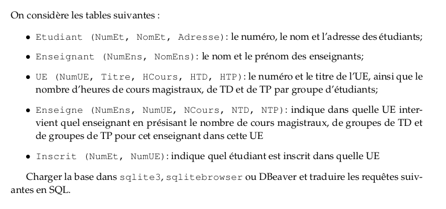

```python
%reload_ext sql
%config SqlMagic.displaycon = False
%config SqlMagic.autolimit = 100
```


```python
%sql sqlite:///base-etudiant.db
```

# Exercice 1:

Donner tous les noms des étudiants.


```python
%%sql

SELECT NomEt FROM Etudiant;
```

    Done.


<table>
    <tr>
        <th>NomEt</th>
    </tr>
    <tr>
        <td>Armand A.</td>
    </tr>
    <tr>
        <td>Berthe B.</td>
    </tr>
    <tr>
        <td>Cendrine C.</td>
    </tr>
    <tr>
        <td>David D.</td>
    </tr>
    <tr>
        <td>Erwan E.</td>
    </tr>
    <tr>
        <td>Fabien F.</td>
    </tr>
    <tr>
        <td>Gerald G.</td>
    </tr>
    <tr>
        <td>Herbert H.</td>
    </tr>
    <tr>
        <td>Jacques J.</td>
    </tr>
</table>


```python
%%sql 
SELECT *
FROM sqlite_master
```

    Done.


<table>
    <tr>
        <th>type</th>
        <th>name</th>
        <th>tbl_name</th>
        <th>rootpage</th>
        <th>sql</th>
    </tr>
    <tr>
        <td>table</td>
        <td>Etudiant</td>
        <td>Etudiant</td>
        <td>2</td>
        <td>CREATE TABLE Etudiant (<br>       NumEt INTEGER PRIMARY KEY,<br>       NomEt VARCHAR2(255),<br>       Adresse VARCHAR2(1000)<br>)</td>
    </tr>
    <tr>
        <td>table</td>
        <td>Enseignant</td>
        <td>Enseignant</td>
        <td>3</td>
        <td>CREATE TABLE Enseignant (<br>       NumEns INTEGER PRIMARY KEY,<br>       NomEns VARCHAR2(255)<br>)</td>
    </tr>
    <tr>
        <td>table</td>
        <td>UE</td>
        <td>UE</td>
        <td>4</td>
        <td>CREATE TABLE UE (<br>       NumUE INTEGER PRIMARY KEY,<br>       Titre VARCHAR2(255),<br>       HCours FLOAT,<br>       HTD FLOAT,<br>       HTP FLOAT<br>)</td>
    </tr>
    <tr>
        <td>table</td>
        <td>Enseigne</td>
        <td>Enseigne</td>
        <td>5</td>
        <td>CREATE TABLE Enseigne (<br>       NumEns INTEGER REFERENCES Enseignant(NumEns),<br>       NumUE INTEGER REFERENCES UE(NumUE),<br>       NCours INTEGER,<br>       NTD INTEGER,<br>       NTP INTEGER,<br>       PRIMARY KEY (NumEns,NumUE)<br>)</td>
    </tr>
    <tr>
        <td>index</td>
        <td>sqlite_autoindex_Enseigne_1</td>
        <td>Enseigne</td>
        <td>6</td>
        <td>None</td>
    </tr>
    <tr>
        <td>table</td>
        <td>Inscrit</td>
        <td>Inscrit</td>
        <td>7</td>
        <td>CREATE TABLE Inscrit (<br>       NumEt INTEGER REFERENCES Etudiant(NumEt),<br>       NumUE INTEGER REFERENCES UE(NumUE),<br>       PRIMARY KEY (NumEt,NumUE)<br>)</td>
    </tr>
    <tr>
        <td>index</td>
        <td>sqlite_autoindex_Inscrit_1</td>
        <td>Inscrit</td>
        <td>8</td>
        <td>None</td>
    </tr>
</table>


```python
%%sql

SELECT name 
FROM sqlite_master
WHERE type = 'table'
```

    Done.


<table>
    <tr>
        <th>name</th>
    </tr>
    <tr>
        <td>Etudiant</td>
    </tr>
    <tr>
        <td>Enseignant</td>
    </tr>
    <tr>
        <td>UE</td>
    </tr>
    <tr>
        <td>Enseigne</td>
    </tr>
    <tr>
        <td>Inscrit</td>
    </tr>
</table>


```python
%%sql

SELECT sql 
FROM sqlite_master
WHERE name = 'Etudiant';
```

    Done.


<table>
    <tr>
        <th>sql</th>
    </tr>
    <tr>
        <td>CREATE TABLE Etudiant (<br>       NumEt INTEGER PRIMARY KEY,<br>       NomEt VARCHAR2(255),<br>       Adresse VARCHAR2(1000)<br>)</td>
    </tr>
</table>


```python
%%sql

SELECT sql 
FROM sqlite_master
WHERE name = 'Enseignant';
```

    Done.


<table>
    <tr>
        <th>sql</th>
    </tr>
    <tr>
        <td>CREATE TABLE Enseignant (<br>       NumEns INTEGER PRIMARY KEY,<br>       NomEns VARCHAR2(255)<br>)</td>
    </tr>
</table>


```python
%%sql

SELECT sql 
FROM sqlite_master
WHERE name = 'UE';
```

    Done.


<table>
    <tr>
        <th>sql</th>
    </tr>
    <tr>
        <td>CREATE TABLE UE (<br>       NumUE INTEGER PRIMARY KEY,<br>       Titre VARCHAR2(255),<br>       HCours FLOAT,<br>       HTD FLOAT,<br>       HTP FLOAT<br>)</td>
    </tr>
</table>


```python
%%sql

SELECT sql 
FROM sqlite_master
WHERE name = 'Enseigne';
```

    Done.


<table>
    <tr>
        <th>sql</th>
    </tr>
    <tr>
        <td>CREATE TABLE Enseigne (<br>       NumEns INTEGER REFERENCES Enseignant(NumEns),<br>       NumUE INTEGER REFERENCES UE(NumUE),<br>       NCours INTEGER,<br>       NTD INTEGER,<br>       NTP INTEGER,<br>       PRIMARY KEY (NumEns,NumUE)<br>)</td>
    </tr>
</table>


```python
%%sql

SELECT sql 
FROM sqlite_master
WHERE name = 'Inscrit';
```

    Done.


<table>
    <tr>
        <th>sql</th>
    </tr>
    <tr>
        <td>CREATE TABLE Inscrit (<br>       NumEt INTEGER REFERENCES Etudiant(NumEt),<br>       NumUE INTEGER REFERENCES UE(NumUE),<br>       PRIMARY KEY (NumEt,NumUE)<br>)</td>
    </tr>
</table>




## Exercice 2

Donner les titre des UEs dans l’ordre alphabétique


```python
%%sql

SELECT Titre 
FROM UE 
ORDER BY Titre ASC;
```

    Done.


<table>
    <tr>
        <th>Titre</th>
    </tr>
    <tr>
        <td>Algebre</td>
    </tr>
    <tr>
        <td>Algorithmique</td>
    </tr>
    <tr>
        <td>Analyse</td>
    </tr>
    <tr>
        <td>Bases de donnes</td>
    </tr>
    <tr>
        <td>Programmation</td>
    </tr>
    <tr>
        <td>Reseaux</td>
    </tr>
</table>


## Exercice 3:
    
Donner le titre des UEs dont le nombre d’heures total (cours, td et cm) par groupe est au moins
46


```python
%%sql

SELECT Titre 
FROM UE 
WHERE HCours + HTD + HTP >= 46;
```

    Done.


<table>
    <tr>
        <th>Titre</th>
    </tr>
    <tr>
        <td>Algorithmique</td>
    </tr>
    <tr>
        <td>Bases de donnes</td>
    </tr>
</table>


## Exercice 4:
    
Donner les noms des étudiants qui ont ’Albert A.’ comme enseignant.


```python
%%sql

SELECT DISTINCT NomEt
FROM 
Etudiant JOIN Inscrit
ON Etudiant.NumET = Inscrit.NumEt
JOIN UE
ON Inscrit.NumUE = UE.NumUE
JOIN Enseigne
ON UE.NumUE = Enseigne.NumUE
JOIN Enseignant
ON Enseigne.NumEns = Enseignant.NumEns
WHERE NomEns = "Albert A."
;
```

    Done.


<table>
    <tr>
        <th>NomEt</th>
    </tr>
    <tr>
        <td>David D.</td>
    </tr>
    <tr>
        <td>Gerald G.</td>
    </tr>
    <tr>
        <td>Jacques J.</td>
    </tr>
</table>


## Exercice 5:
    
Donner les titres des cours ayant au moins un étudiant inscrit et dont le nombre d’heures de
TD est au moins 18.


```python
%%sql

SELECT  Titre, HTD
FROM 
Etudiant JOIN Inscrit
ON Etudiant.NumET = Inscrit.NumEt
JOIN UE
ON Inscrit.NumUE = UE.NumUE
WHERE HTD >= 18
GROUP BY Titre
;
```

    Done.


<table>
    <tr>
        <th>Titre</th>
        <th>HTD</th>
    </tr>
    <tr>
        <td>Algebre</td>
        <td>25.0</td>
    </tr>
    <tr>
        <td>Analyse</td>
        <td>25.0</td>
    </tr>
    <tr>
        <td>Bases de donnes</td>
        <td>18.0</td>
    </tr>
</table>


## Exercice 6:
    
Donner les noms des enseignants qui enseignent dans la même UE que ’Albert A.’ (sauf Albert
A. lui-même).


```python
%%sql

SELECT 
    DISTINCT NomEns
    FROM 
    UE JOIN Enseigne 
    ON UE.NumUE = Enseigne.NumUE
    JOIN Enseignant 
    ON Enseigne.NumEns = Enseignant.NumEns
    WHERE NomEns != "Albert A." 
    AND Titre IN (    
            SELECT 
                Titre
                FROM 
                UE JOIN Enseigne
                ON UE.NumUE = Enseigne.NumUE
                JOIN Enseignant
                ON Enseigne.NumEns = Enseignant.NumEns
                WHERE NomEns = "Albert A."
                );
```

    Done.


<table>
    <tr>
        <th>NomEns</th>
    </tr>
    <tr>
        <td>Bertrand B.</td>
    </tr>
</table>


Plutot : 


```python
%%sql

SELECT 
    DISTINCT NomEns
    FROM Enseigne 
    JOIN Enseignant 
    ON Enseigne.NumEns = Enseignant.NumEns
    WHERE NomEns != "Albert A." 
    AND NumUE IN (    
            SELECT 
                NumUE
                FROM Enseigne 
                JOIN Enseignant 
                ON Enseigne.NumEns = Enseignant.NumEns
                WHERE NomEns = "Albert A."
                );
```

    Done.


<table>
    <tr>
        <th>NomEns</th>
    </tr>
    <tr>
        <td>Bertrand B.</td>
    </tr>
</table>


```python
%%sql

SELECT DISTINCT Ens2.NomEns
FROM Enseigne AS E1
JOIN Enseigne AS E2
ON E2.NumUE = E1.NumUE
JOIN Enseignant AS Ens1
ON E1.NumEns = Ens1.NumEns
JOIN Enseignant AS Ens2
ON E2.NumEns = Ens2.NumEns
WHERE Ens1.NomEns = "Albert A." AND E1.NumEns <> E2.NumEns ;
```

    Done.


<table>
    <tr>
        <th>NomEns</th>
    </tr>
    <tr>
        <td>Bertrand B.</td>
    </tr>
</table>


```python
%%sql

SELECT 
NomEns, Titre
FROM 
UE
JOIN Enseigne
ON UE.NumUE = Enseigne.NumUE
JOIN Enseignant
ON Enseigne.NumEns = Enseignant.NumEns
;
```

    Done.


<table>
    <tr>
        <th>NomEns</th>
        <th>Titre</th>
    </tr>
    <tr>
        <td>Albert A.</td>
        <td>Analyse</td>
    </tr>
    <tr>
        <td>Albert A.</td>
        <td>Algebre</td>
    </tr>
    <tr>
        <td>Bertrand B.</td>
        <td>Analyse</td>
    </tr>
    <tr>
        <td>Bertrand B.</td>
        <td>Algebre</td>
    </tr>
    <tr>
        <td>Carine C.</td>
        <td>Programmation</td>
    </tr>
    <tr>
        <td>Carine C.</td>
        <td>Algorithmique</td>
    </tr>
    <tr>
        <td>Carine C.</td>
        <td>Bases de donnes</td>
    </tr>
    <tr>
        <td>David D.</td>
        <td>Programmation</td>
    </tr>
    <tr>
        <td>David D.</td>
        <td>Algorithmique</td>
    </tr>
    <tr>
        <td>David D.</td>
        <td>Bases de donnes</td>
    </tr>
    <tr>
        <td>Edgar E.</td>
        <td>Programmation</td>
    </tr>
    <tr>
        <td>Edgar E.</td>
        <td>Algorithmique</td>
    </tr>
    <tr>
        <td>Edgar E.</td>
        <td>Bases de donnes</td>
    </tr>
</table>


## Exercice 7:

Donner le nombre total d’heures de cours/TD/TP dispensées à l’université. On nommera
TOTAL_HEURES ce nombre.


```python
%%sql

SELECT 
SUM(HCours * NCours + HTD * NTD + HTP * NTP) AS TOTAL_HEURES
FROM 
UE
JOIN Enseigne
ON UE.NumUE = Enseigne.NumUE
;
```

    Done.


<table>
    <tr>
        <th>TOTAL_HEURES</th>
    </tr>
    <tr>
        <td>436.0</td>
    </tr>
</table>


## Exercice 8:

Donner le nombre d’UE n’ayant pas de TP (on appellera NB_UES l’attribut donnant ce résultat).


```python
%%sql

SELECT
COUNT(*) 
FROM
UE
WHERE HTP = 0
;
```

    Done.


<table>
    <tr>
        <th>COUNT(*)</th>
    </tr>
    <tr>
        <td>2</td>
    </tr>
</table>


```python
%%sql

SELECT
COUNT(*) 
FROM
(SELECT 
UE.NumUE
FROM 
UE JOIN Enseigne
ON UE.NumUE = Enseigne.NumUE
GROUP BY UE.NumUE
HAVING SUM(HTP * NTP) = 0
 )
;
```

    Done.


<table>
    <tr>
        <th>COUNT(*)</th>
    </tr>
    <tr>
        <td>2</td>
    </tr>
</table>


Plutot la requête ci-dessous


```python
%%sql

SELECT 
    COUNT(*)
    FROM(
        SELECT  Titre
        FROM  UE
        
        EXCEPT
        
        SELECT  Titre
        FROM UE JOIN Enseigne
        ON UE.NumUE = Enseigne.NumUE
        GROUP BY UE.NumUE
        HAVING SUM(HTP * NTP) > 0
    );

```

    Done.


<table>
    <tr>
        <th>COUNT(*)</th>
    </tr>
    <tr>
        <td>3</td>
    </tr>
</table>


## Exercice 9:
    
Donner le nombre d’étudiants qui suivent le cours d’Analyse (on appellera NB_ETUDIANTS
l’attribut donnant ce nombre).


```python
%%sql

SELECT COUNT(*) AS NB_ETUDIANTS
FROM 
Etudiant JOIN Inscrit
ON Etudiant.NumET = Inscrit.NumEt
JOIN UE
ON Inscrit.NumUE = UE.NumUE
WHERE Titre = "Analyse"
;
```

    Done.


<table>
    <tr>
        <th>NB_ETUDIANTS</th>
    </tr>
    <tr>
        <td>3</td>
    </tr>
</table>


## Exercice 10

Donner la moyenne du nombre d’heures de cours, de TD et de TP par UE. On appelera MOY_COURS
la moyenne des heures, MOY_TD celle des TD et MOY_TP celle des TPs.


```python
%%sql

SELECT
AVG(HCours) AS MOY_COURS, AVG(HTD) AS  MOY_TD, AVG(HTP) AS MOY_TP
FROM  UE ;
```

    Done.


<table>
    <tr>
        <th>MOY_COURS</th>
        <th>MOY_TD</th>
        <th>MOY_TP</th>
    </tr>
    <tr>
        <td>16.5</td>
        <td>16.333333333333332</td>
        <td>8.333333333333334</td>
    </tr>
</table>


## Exercice 11:

Donner pour chaque étudiant le nombre total d’heures qu’il suit. On donnera dans le résultat
le numéro de l’étudiant ainsi qu’un attribut HEURES qui indiquera son nombre d’heures.


```python
%%sql

SELECT Etudiant.NumEt, SUM(HTP + HTD + HCours) AS HEURES
    FROM  Etudiant JOIN Inscrit
    ON Etudiant.NumET = Inscrit.NumEt
    JOIN UE
    ON Inscrit.NumUE = UE.NumUE              
    GROUP BY Etudiant.NumEt
    ORDER BY HEURES DESC
;
```

    Done.


<table>
    <tr>
        <th>NumEt</th>
        <th>HEURES</th>
    </tr>
    <tr>
        <td>1117</td>
        <td>185.0</td>
    </tr>
    <tr>
        <td>1111</td>
        <td>149.0</td>
    </tr>
    <tr>
        <td>1114</td>
        <td>143.0</td>
    </tr>
    <tr>
        <td>1119</td>
        <td>135.0</td>
    </tr>
    <tr>
        <td>1112</td>
        <td>104.0</td>
    </tr>
    <tr>
        <td>1116</td>
        <td>62.0</td>
    </tr>
    <tr>
        <td>1118</td>
        <td>62.0</td>
    </tr>
    <tr>
        <td>1115</td>
        <td>50.0</td>
    </tr>
</table>


Plutot la requête suivante


```python
%%sql

SELECT NumEt, SUM(HTP + HTD + HCours) AS HEURES
    FROM  (
            SELECT UE.NumUE, Etudiant.NumEt, HTP,  HTD, HCours  
                    Etudiant JOIN Inscrit
                    ON Etudiant.NumET = Inscrit.NumEt
                    JOIN UE
                    ON Inscrit.NumUE = UE.NumUE
                    JOIN Enseigne
                    ON UE.NumUE = Enseigne.NumUE
                WHERE NCours+ NTD + NTP != 0
                GROUP BY Etudiant.NumEt, UE.NumUE
        )
    GROUP BY NumEt
    ORDER BY HEURES DESC
;
```

    Done.


<table>
    <tr>
        <th>NumEt</th>
        <th>HEURES</th>
    </tr>
    <tr>
        <td>1117</td>
        <td>185.0</td>
    </tr>
    <tr>
        <td>1111</td>
        <td>149.0</td>
    </tr>
    <tr>
        <td>1114</td>
        <td>135.0</td>
    </tr>
    <tr>
        <td>1119</td>
        <td>135.0</td>
    </tr>
    <tr>
        <td>1112</td>
        <td>104.0</td>
    </tr>
    <tr>
        <td>1116</td>
        <td>54.0</td>
    </tr>
    <tr>
        <td>1118</td>
        <td>54.0</td>
    </tr>
    <tr>
        <td>1115</td>
        <td>50.0</td>
    </tr>
</table>


## Exercice 12:
    
Donner les numéros des enseignants qui effectuent plus de 17 heures de cours magistraux.
Attention, ici une clause HAVING est nécessaire.


```python
%%sql

SELECT 
Enseignant.NumEns,NomEns, SUM(HCours) AS HEURES_COURS
FROM 
UE
JOIN Enseigne
ON UE.NumUE = Enseigne.NumUE
JOIN Enseignant
ON Enseigne.NumEns = Enseignant.NumEns
GROUP BY Enseignant.NumEns
HAVING SUM(HCours * NCours) > 17
;
```

    Done.


<table>
    <tr>
        <th>NumEns</th>
        <th>NomEns</th>
        <th>HEURES_COURS</th>
    </tr>
    <tr>
        <td>111</td>
        <td>Albert A.</td>
        <td>40.0</td>
    </tr>
    <tr>
        <td>112</td>
        <td>Bertrand B.</td>
        <td>40.0</td>
    </tr>
    <tr>
        <td>114</td>
        <td>David D.</td>
        <td>53.0</td>
    </tr>
    <tr>
        <td>115</td>
        <td>Edgar E.</td>
        <td>53.0</td>
    </tr>
</table>


```python
%%sql

SELECT 
*
FROM 
UE
JOIN Enseigne
ON UE.NumUE = Enseigne.NumUE
JOIN Enseignant
ON Enseigne.NumEns = Enseignant.NumEns
;
```

    Done.


<table>
    <tr>
        <th>NumUE</th>
        <th>Titre</th>
        <th>HCours</th>
        <th>HTD</th>
        <th>HTP</th>
        <th>NumEns</th>
        <th>NumUE_1</th>
        <th>NCours</th>
        <th>NTD</th>
        <th>NTP</th>
        <th>NumEns_1</th>
        <th>NomEns</th>
    </tr>
    <tr>
        <td>1</td>
        <td>Analyse</td>
        <td>20.0</td>
        <td>25.0</td>
        <td>0.0</td>
        <td>111</td>
        <td>1</td>
        <td>1</td>
        <td>1</td>
        <td>0</td>
        <td>111</td>
        <td>Albert A.</td>
    </tr>
    <tr>
        <td>2</td>
        <td>Algebre</td>
        <td>20.0</td>
        <td>25.0</td>
        <td>0.0</td>
        <td>111</td>
        <td>2</td>
        <td>0</td>
        <td>1</td>
        <td>0</td>
        <td>111</td>
        <td>Albert A.</td>
    </tr>
    <tr>
        <td>1</td>
        <td>Analyse</td>
        <td>20.0</td>
        <td>25.0</td>
        <td>0.0</td>
        <td>112</td>
        <td>1</td>
        <td>0</td>
        <td>1</td>
        <td>0</td>
        <td>112</td>
        <td>Bertrand B.</td>
    </tr>
    <tr>
        <td>2</td>
        <td>Algebre</td>
        <td>20.0</td>
        <td>25.0</td>
        <td>0.0</td>
        <td>112</td>
        <td>2</td>
        <td>1</td>
        <td>1</td>
        <td>0</td>
        <td>112</td>
        <td>Bertrand B.</td>
    </tr>
    <tr>
        <td>3</td>
        <td>Programmation</td>
        <td>15.0</td>
        <td>15.0</td>
        <td>15.0</td>
        <td>113</td>
        <td>3</td>
        <td>1</td>
        <td>1</td>
        <td>1</td>
        <td>113</td>
        <td>Carine C.</td>
    </tr>
    <tr>
        <td>4</td>
        <td>Algorithmique</td>
        <td>20.0</td>
        <td>15.0</td>
        <td>15.0</td>
        <td>114</td>
        <td>4</td>
        <td>1</td>
        <td>1</td>
        <td>1</td>
        <td>114</td>
        <td>David D.</td>
    </tr>
    <tr>
        <td>5</td>
        <td>Bases de donnes</td>
        <td>18.0</td>
        <td>18.0</td>
        <td>18.0</td>
        <td>115</td>
        <td>5</td>
        <td>1</td>
        <td>1</td>
        <td>1</td>
        <td>115</td>
        <td>Edgar E.</td>
    </tr>
    <tr>
        <td>4</td>
        <td>Algorithmique</td>
        <td>20.0</td>
        <td>15.0</td>
        <td>15.0</td>
        <td>113</td>
        <td>4</td>
        <td>0</td>
        <td>0</td>
        <td>1</td>
        <td>113</td>
        <td>Carine C.</td>
    </tr>
    <tr>
        <td>5</td>
        <td>Bases de donnes</td>
        <td>18.0</td>
        <td>18.0</td>
        <td>18.0</td>
        <td>113</td>
        <td>5</td>
        <td>0</td>
        <td>1</td>
        <td>1</td>
        <td>113</td>
        <td>Carine C.</td>
    </tr>
    <tr>
        <td>3</td>
        <td>Programmation</td>
        <td>15.0</td>
        <td>15.0</td>
        <td>15.0</td>
        <td>114</td>
        <td>3</td>
        <td>0</td>
        <td>0</td>
        <td>1</td>
        <td>114</td>
        <td>David D.</td>
    </tr>
    <tr>
        <td>5</td>
        <td>Bases de donnes</td>
        <td>18.0</td>
        <td>18.0</td>
        <td>18.0</td>
        <td>114</td>
        <td>5</td>
        <td>0</td>
        <td>1</td>
        <td>1</td>
        <td>114</td>
        <td>David D.</td>
    </tr>
    <tr>
        <td>3</td>
        <td>Programmation</td>
        <td>15.0</td>
        <td>15.0</td>
        <td>15.0</td>
        <td>115</td>
        <td>3</td>
        <td>0</td>
        <td>0</td>
        <td>1</td>
        <td>115</td>
        <td>Edgar E.</td>
    </tr>
    <tr>
        <td>4</td>
        <td>Algorithmique</td>
        <td>20.0</td>
        <td>15.0</td>
        <td>15.0</td>
        <td>115</td>
        <td>4</td>
        <td>0</td>
        <td>1</td>
        <td>1</td>
        <td>115</td>
        <td>Edgar E.</td>
    </tr>
</table>


