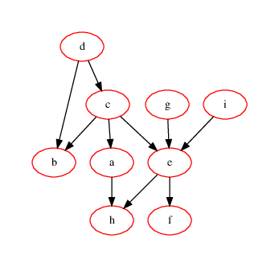
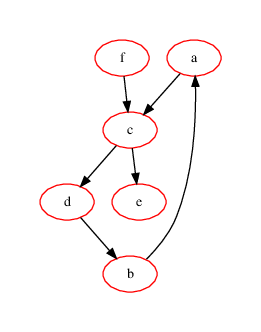

# Contexte

Vous travaillez au service _Notice de montage_ de l'entreprise  __AEKI__ qi fabrique et commercialise des meubles en kit, _à monter soi-même_.

Pour chaque nouveau produit, le service ingénierie vous founit un schéma sous la forme d'un _graphe de contraintes_ qui est un graphe orienté :

*  chaque étape de montage  est un sommet du graphe, identifié par une étiquette distincte choisie aléatoirement  parmi les  lettres minuscules 
*  un arc reliant deux sommets du graphe exprime une contrainte d'ordre (ou _relation de précédence_ ou _relation de dépendance_) dans le montage  : 
par exemple un arc d'origine  le sommet d'étiquette `'c'` et d'extrémité le sommet d'étiquette  `'a'`  signifie que  l'étape de montage `'c'` doit être réalisée avant l'étape `'a'`.

Attention, L'étiquetage étant aléatoire, l'ordre alphabétique sur les étiquettes des étapes n'est pas forcément l'ordre de montage !

À partir d'un tel graphe, vous devez définir un ordre d'exécution des étapes de montage pour la notice de montage, permettant à un utilisateur de monter le produit en respectant toutes les contraintes.

# Questions 

1. Le service ingénierie vous a fourni le __graphe 1__ de contraintes ci-dessous :

    \

   * L'ordre de montage   `'d' -> 'g' -> 'i' -> 'c' -> 'b' -> 'a' -> 'h' -> 'f' -> 'e'` respecte-t-il les contraintes du graphe ?
   * Comment modifier cet ordre pour qu'il respecte les contraintes du graphe ?
   * Pouvez-vous trouver un autre ordre de montage ?

2. Le service ingénierie vous a fourni le __graphe 2__ de contraintes ci-dessous :

    \

    * Pouvez-vous déterminer un ordre de montage respectant ces contraintes ?
    * Quelle condition nécessaire doit vérifier un graphe de contraintes pour qu'un ordre de montage existe ? On admet que cette condition nécessaire est suffisante, 
    c'est-à-dire que si elle est vérifiée alors un ordre de montage existe.

3. Votre chef vous demande d'écrire en pseudo-code  un algorithme qui automatise la génération d'un ordre de montage à partir d'un ugraphe de contraintes pour lequel il existe un ordre de montage.
Ayant suivi la spécialité NSI au lycée, vous vous souvenez des algorithmes gloutons présentés en classe de première.

   * Citez au moins un algorithme glouton que vous avez déjà rencontré.
   * Dans le cadre de votre problème, pour obtenir un ordre de montage compatible avec le graphe, quel choix  glouton peut-on faire à chaque étape ?
   * Proposez l'écriture en pseudo-code d'un algorithme glouton qui permettrait de déterminer un ordre de montage compatible avec un graphe donné.
   * Déroulez cet algorithme sur le __graphe 1__ de contraintes ci-dessus.
   * On ne demande pas de démontrer que l'algorithme est correct, mais pouvez-vous estimer la complexité de votre algorithme en fonction du nombre d'étapes de montage (sommets du graphe) et du nombre d'arêtes (les contraintes) ?
   * Un ordre de montage pour un graphe de contraintes s'appelle un __ordre topologique__ sur les sommets du graphe. Implémentez votre algorithme en `Python` en complétant la méthode `topological_sort_greedy` de la classe `DirectGraph` dans le  fichier `lib_graphes.py`. Commencez par lire la documentation de la classe `DirectGraph`.
   * Testez votre méthode avec le fichier `main.py`, affichez d'abord l'aide avec `python3 main.py h`.
   * Complétez le code de la  méthode `verif_topological_order`  de la classe `DirectGraph` dans le  fichier `lib_graphes.py` pour qu'elle vérifie si un ordre de montage donné en paramètre est bien compatible avec le graphe de contraintes.

4. Il existe un autre algorithme pour déterminer un ordre topologique sur les sommets d'un graphe, basé sur un parcours en profondeur du graphe. 
   
   * Visionnez ce tutoriel video <https://youtu.be/eVsCO71q1L0>, puis implémentez cet algorithme en complétant la méthode `topological_sort_dfs` de la classe `DirectGraph` dans le  fichier `lib_graphes.py`.
   * Testez votre méthode avec le fichier `main.py`. 

-----------------------------

# Sitographie :

* Article _S’aider des graphes pour élaborer une notice de montage_   dont l'URL est   <https://interstices.info/saider-des-graphes-pour-elaborer-une-notice-de-montage/>
